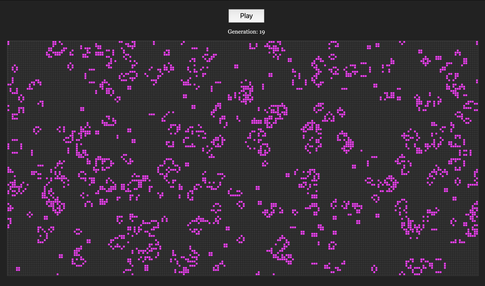

# Conway's Game Of Life

An implementation of Life using pure JS and an HTML5 canvas.

For more details on Life check out this
[wikipedia page](https://en.wikipedia.org/wiki/Conway%27s_Game_of_Life).

## Requirements
A ding-dang browser. Preferably a modern one.

## Running the game
Double click `index.html` to open it in your browser of choice and click that
big ol' Play button.

Play can be stopped or started by the same button. The current generation is
real-time within the UI.

## Tweaking it
In [game.js](https://github.com/carterbancroft/life-csnw/blob/master/js/game.js#L12-L34)
the highlighted lines in the link can be modified to change the way the game
runs.

The key variables to play with are:

- `cellSize` (int) - Cells are squares, this adjusts the height/width of all
cells.
- `rows` and `cols` (int) - Defines the number of rows and columns in the world.
- `lifeThreshold` (float) - Value between 0 and 1 that defines how likely it is
for a given cell to be alive upon world generation. The less likely a cell will
be alive.
- `loopSpeedMs` (int) - Defines how much time elapses per generation. The higher
the number the more time you can give yourself to look at the current
generation.

## Ideas that would be cool to implement
- The ability to draw a starting state instead of having it be random.
- Having a slider that could be used on game pause to rewind/replay the current
game.
- Making the world toroidal instead of spherical.
- A UI to update things like game speed and the size of the world.

## Happy accidents
I had this thing happen where I was accidentally calling `world.update()` an
extra time before drawing the world during each generation. It created this
really cool, slow moving, effect of the cells taking over the entire world. They
would start to look like mountain ranges and would never fully engulf the world.

Pretty neat, no idea what the actual cause of that bug was other than me
running the rules of the game one too many times each generation.

